# Interactive Mapping Options: QGIS

Using QGIS, we've created several map layouts and exported these as image files. In general, we can consider these maps to be static maps. The map image can be exported in several resolutions. People view and learn from your map. Static maps are fantastic! For your final project, you can absolutely create a static map.

As you've seen in MAP 671, we can also create interactive maps, such as maps where certain features display on a given zoom level. For example, in OpenStreetMap, you created styles that would show roads on specific zoom levels. That type of interaction occurred within QGIS, what about creating a map that had that functionality on a website?

Zoomable, interactive maps are the primary focus of module 03. In this first activity, you will try out two approaches for exporting QGIS maps. Later activities will focus on zoomable maps using Mapbox.

At the end of this activity, you will submit one zoomable QGIS map. Details are below!

## Adding Static Maps Review

For static maps, as discussed previously, an index.html file can be modified to include an `img src` link to a map file. You can create additional edits to an index.html file so that you now have a picture of your map and additional information posted about the map. A similar approach, but with a slightly different `img src` tag, can be used to add maps and associated mapping information to a markdown file.

## Adding Zoomable Maps

How do you add zoomable maps to an index.html file using a QGIS map?

Two examples are provided below for QGIS. You can take an existing map you already built in QGIS to test out the following approaches. This section about QGIS is intended to show you an example of what is possible in QGIS in case it's helpful for future mapping ideas (such as the final project!). If you'd like to create a new QGIS map, you are welcome to do, but **it's not required to create a new map.**

Let's review the folders in this repository:

* *map-options* - this folder contains an example index.html and tiles.html file that are helpful for presenting maps exported from QGIS, including the zoomable maps below. You may also see the tiles.html file labeled as map.html. As long as you maintain name consistency in links, the file could be referenced using either approach.

Below are 2 examples of exporting maps in QGIS. You will select one of these to turn in as an assignment.

## Zoomable map in QGIS, option #1

In QGIS, there's a workflow available where you can export a layout as a tiled map. For example, this map is a full-screen example created for a local art fair in a park. It uses the gdal2tiles tool to make the zoomable base map and adds GeoJSON elements for interactivity. We will revisit this style of mapping extensively in Map 672! Stay tuned.

Here's the map!

https://outragegis.com/maps/fair/

How might you start making such a map? Let's review a few steps below.

### Step 1: Export layout as georeferenced TIFF

Before we use the **gdal2tiles** tool, we need to have a layout in *Layout Composer* ready for export. You could select any map layout that you've created in a previous module. Let's export the image in the **TIFF** format at a higher resolution.

Within the Layout menu, select Layout > Export As Image > .TIFF

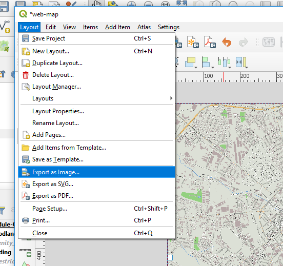<br><br>
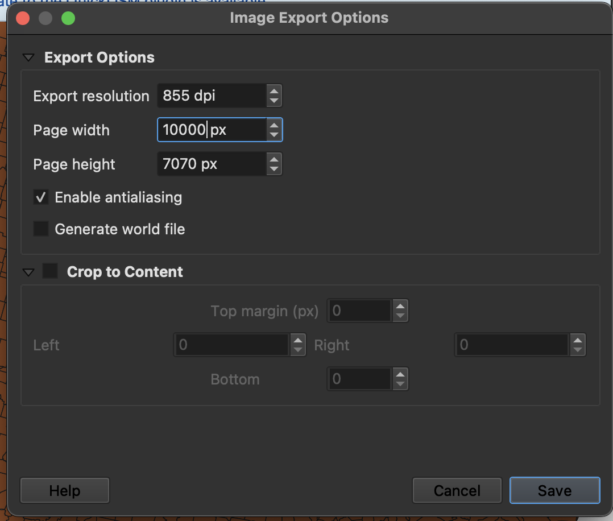   
*Export a GeoTIFF at high resolution*

Make the resolution greater than 10,000 px in your long-edge dimension. Make sure not to cover too large of an extent (don't do New York City) because we can create a tileset many hundreds of MBs in size. If the file size gets too large, you wouldn't be able to host on GitHub, for example.

### Step 2: Use gdal2tiles to make a zoomable map

Now we have a georeferenced TIFF image. Add that image as a new layer to a map selecting the raster option for the data type. 

This static image is what we'll use to create our zoomable map. 

Find the **gdal2tiles** tool in the QGIS *Processing Toolbox* under ** GDAL > Raster Miscellaneous > gdal2tiles**.

If you ran this with the tool with the default settings, it might work. We will likely need to change the zoom range. Make your zoom levels no greater than 17 (higher is more zoomed in). Trying a narrower zoom range can help. The more zoom levels you are trying to tile, the larger the overall project becomes in file size!

Make your output directory as the _/map-options/tiles_ directory. Your settings might look similar to the following. Please make sure to scroll to the bottom of the window to set the save location.

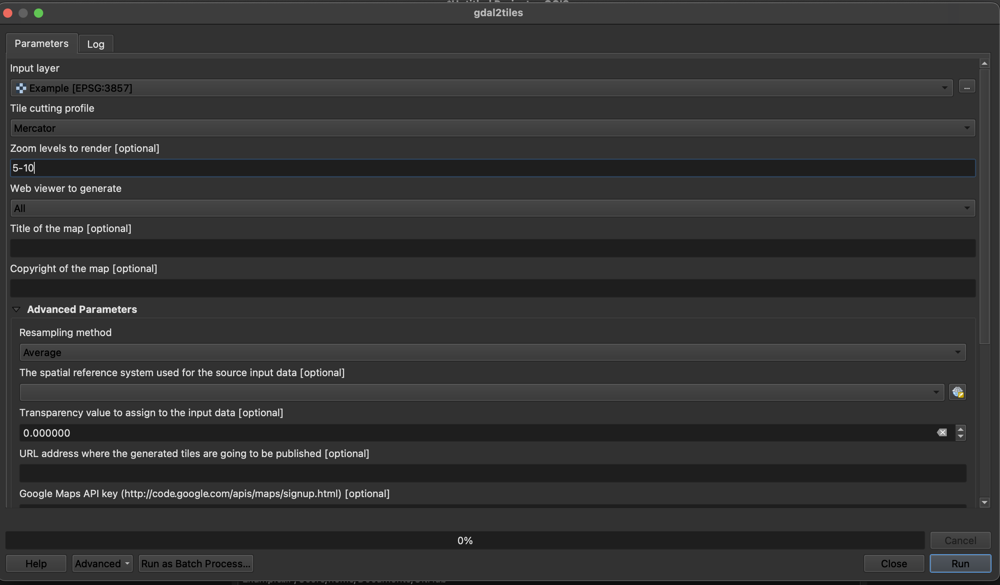   
*gdal2tiles settings*

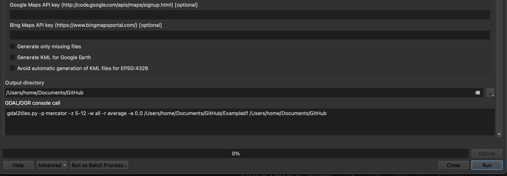   
*gdal2tiles settings continued*

Notice the code at the bottom. The _GDAL/OGR odconsole call_ is the command we would use on the command line. This is helpful for scripting and automating these tasks.

### Step 3: Inspect output

After export has completed, look in the directory and find a series of folders and a few HTML files. Each folder contains additional folders, each holding PNG images of a tiny section of your area. As the numbers increase, so does the scale. Look at an individual tile and see if you can recognize it's location.

Take all these newly exported files and save them within a folder called _tiles_.

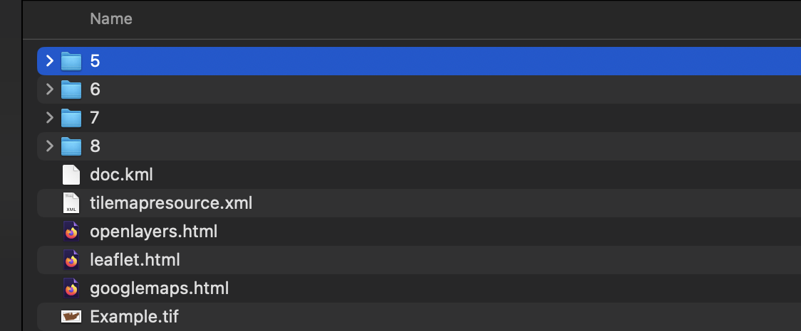   
*Contents of export folder*

Open one _leaflet.html_ in your browser. You should see your map over an OpenStreetMap base map. 

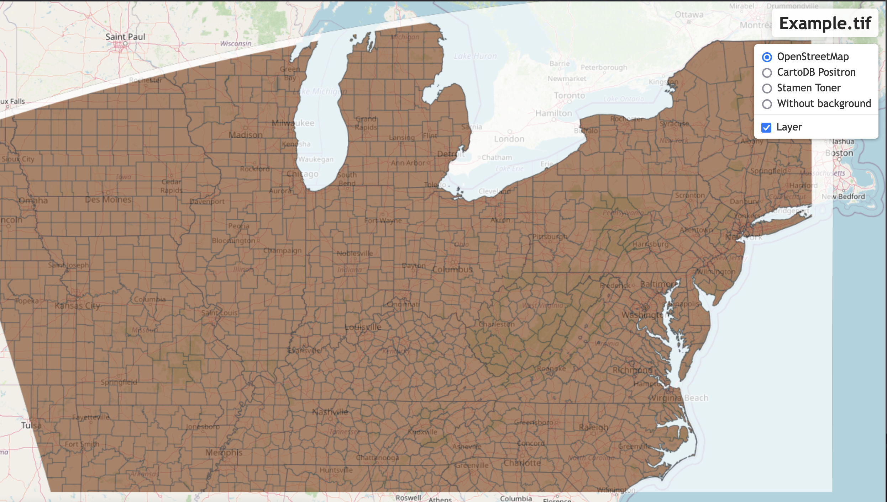   
*Contents of export folder*

Check the file size of the _tiles_ directory. If it's over 100 MB, then it is getting too large. You might need to shrink the extent of your georeferenced TIFF. Because each tile is small (256 px square), the individual tile file size is small enough that we don't break GitHub rules. Collectively, though, the project can be large. Each repository cannot be larger than 1 GB, so we need to find a balance between detail and project size.

If it looks good and the file size isn't too large, then let's publish the map.

### Step 4: Publish tiles to web page

The linked resources in this _leaflet.html_ access non-secured URLs. We need _https_ resources. We have created two _html_ files in the _map-options_ folder that we'll use instead of the HTML files produced by gdal2tiles.

In the _tiles.html_ file you'll need to find comments that you should change to appropriate values:

```javascript
<script>
    $(document).ready(function () {

      // ***!***
      // Change the initial view coordinates and zoom level to match your map
      //***!***
      var map = L.map('map').setView([38.00, -84.50], 14);

      //***!***
      // Change the L.tileLayer(path/to/tiles/{z}/{x}/{y}.png) property
      // Should work as is if you didn't change names or create extra folders
      //***!***
      var mytile = L.tileLayer('tiles/{z}/{x}/{y}.png', {
        maxZoom: 16,
        tms: true,
        attribution: 'Generated by gdal2tiles'
      }).addTo(map);

      // ***!*** Nothing else to change

      // Below code block adds a geolocation tool and scale.
      // Stay tuned for Map 672 for more!
      // Use the geolocate plugin!
        var locate_options = {
        watch: true,
        enableHighAccuracy: true,
        position: 'topleft'
      };
      L.control.locate(locate_options).addTo(map); // add the tool to the map

      L.control.scale().addTo(map); // maps like this need scales, yo!

    })
  </script>
```

**Don't change anything else in this file**. Now open the _index.html_ file and change the following (if necessary):

* Uncomment the iframe line of code
* Make any changes to the text, headers, and titles on the page
* Make any changes to the authorship information

Test it out in Visual Studio Code!

Viewing the index.html file in Live Server will pull from the tiles.html file and you have a zoomable map!

## Zoomable, map that changes with zoom level in QGIS, option #2

In the first QGIS example, we showed how to export a map layout as a tif which you could then zoom in and out of. In previous modules, you've created QGIS maps with styles in which some layers and labels appear as zoom levels increase or decrease. You are able to export this same interativity to an online zoomable map.

### Step 1: Have a map with some feature that changes based on zoom levels

You can try this approach using a map that has some feature that changes based on zoom levels. For example, what if the primary and secondary roads layer only appears after the map zooms in? Or maybe a county outline appears from a general state map only after the map is zoomed in slightly?

You can utilize an existing map from previous weeks or you can create a map with an item that changes based on zoom level.

### Step 2: Utilize the Generate XYZ Tiles (Directory)

Navigate to the Processing Toolbox and select **Raster Tools > Generate XYZ Directory**

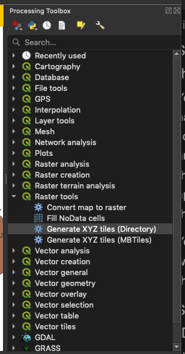   
*Locating the Generate XYZ tiles processing tool*

Then the menu option will open. For the first row *Extent*, you can click the dropdown arrow on the right side and select from a few options. You try draw on canvas, so that you can draw a bounding box around exactly the area you'd like to map. If you draw too large of an area, or try the entire extent of a layer, you might end up trying to create a large directory that takes up a lot of processing time. Start small to get an idea about how the tool works!

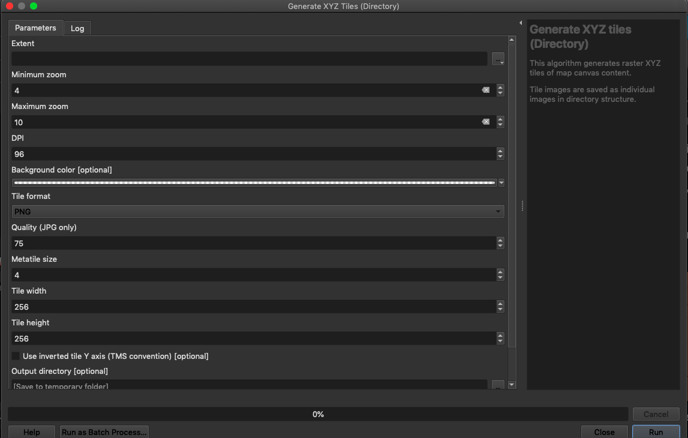   
*Reviewing menu options for XYZ tiles*

Similarly, for the zoom levels, as the zoom level increases, the number of tiles increases. As zoom level increases, you are zooming into the map. Maybe try testing a feature that changes in a mid-zoom range. You can test out some styles, try exporting across a few zoom ranges, and see how the output appears.

You might find the zoom and scale discussion on this [page to be a helpful guide as well](https://developers.arcgis.com/documentation/mapping-apis-and-services/reference/zoom-levels-and-scale/)

At the bottom of the XYZ Tiles processing tool, please select an output directory and an output html file. Click the (...) dropdown and navigate to a save location so that QGIS can list the full file path.

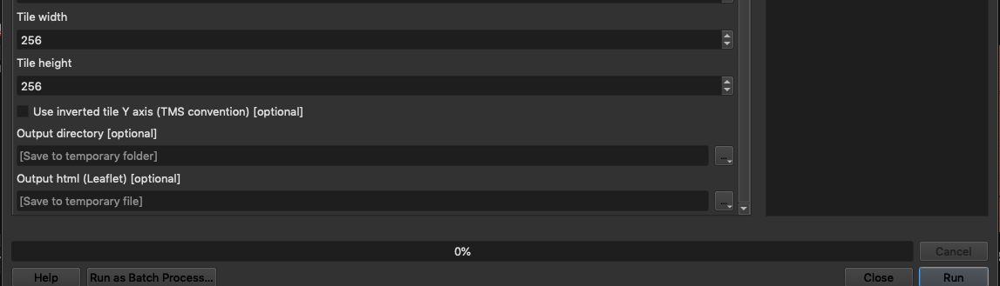   
*Reviewing menu options for XYZ tiles, part two*

### Step 3: Inspect output

You can open the newly created html file that you specified in the output html section of the processing toolbox window. This file should have a link already made to the directory that you specified. If there are any issues, you can check the link using Visual Studio Code and update as needed.

If you look within the html file, you'll see a full screen map, such as the example below. At one zoom level, you see the county outlines in Kentucky.

At the next zoom level, the county names appear!

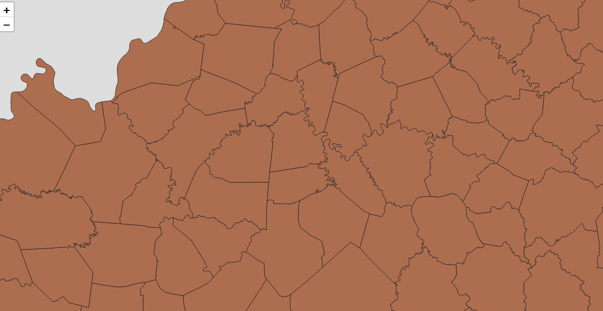   
*Locating the Generate XYZ tiles processing tool*

That's a zoomable map created using QGIS!

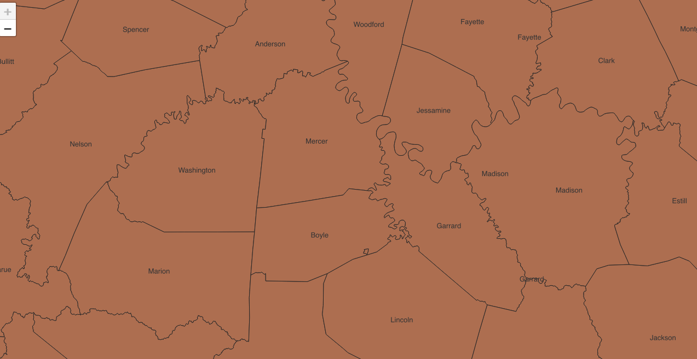   
*Locating the Generate XYZ tiles processing tool*

### Step 4: Create index.html file with iframe element

Using a similar approach to the static map gdal2tiles approach, you could create an index.html and map.html file that provided your zoomable QGIS map within the index.html file! 

With these initial examples, you've seen how QGIS can be used to create zoomable maps. How interesting! Now let's move on to Mapbox!

## How to submit the assignment

Please select one of those options to complete for the zoomable map from QGIS.

1. Create a new folder in this repository called _qgis-zoom_

2. Copy the required files into this folder from the repository so that the zoomable map can be viewed completely within the _qgis-zoom_ folder.

3. Submit the url for your repository on Canvas.

4. The assignment is graded as follows:

* 40 points - folder contains exported tiles from QGIS saved in a _tiles_ folder
* 20 points - edits made to index.html file
* 20 points - edits made to tiles.html file
* 20 points - index.html file loads and includes the zoomable map